# 📸 **Social Media App**

Welcome to **Social Media App**, a sleek and modern mobile application inspired by Instagram! This app allows users to connect, share, and engage with others through posts, bookmarks, notifications, and more. 🚀

---

## 🌟 **Features**

- 🏠 **Home Feed**: Scroll through posts from users you follow.
- 🔖 **Bookmark Page**: Save your favorite posts for later.
- 👤 **Profile Page**: View and edit your profile details.
- ➕ **Add Post**: Share your moments with the world.
- 🔔 **Notifications**: Stay updated with likes, comments, and follows.
- 🔑 **Login/Signup**: Secure authentication to access your account.

---

## 🛠️ **Tech Stack**

This app is built using modern technologies to ensure a seamless experience:

| **Technology**                                                                                                    | **Description**                                      |
| ----------------------------------------------------------------------------------------------------------------- | ---------------------------------------------------- |
|                    | Cross-platform mobile app development framework.     |
|  | Backend-as-a-service for real-time data and storage. |
|                     | Strongly typed programming language for JavaScript.  |
|                                       | Framework for building React Native apps with ease.  |
|                                         | Styling for the app's UI components.                 |

---

## 📱 **Pages Overview**

### 🏠 **Home Page**

- Displays a feed of posts from users you follow.
- Infinite scrolling for a smooth browsing experience.

### 🔖 **Bookmark Page**

- Save posts you love for easy access later.
- Organized and user-friendly layout.

### 👤 **Profile Page**

- View your profile details, posts, and followers.
- Edit your profile picture, bio, and other details.

### ➕ **Add Post**

- Upload photos and captions to share with your followers.
- Simple and intuitive interface for creating posts.

### 🔔 **Notifications**

- Get real-time updates on likes, comments, and follows.
- Stay connected with your audience.

### 🔑 **Login/Signup**

- Secure authentication system.
- Easy onboarding for new users.

---

## 🚀 **Getting Started**

Follow these steps to run the app locally:

1. Clone the repository:
   ```bash
   git clone https://github.com/your-username/social-media-app.git
   cd social-media-app
   npm install
   expo start
   ```

---

## 📂 **Project Structure**

```
/src
  /components    # Reusable UI components
  /pages         # Screens for each page (Home, Profile, etc.)
  /services      # API and backend integration
  /assets        # Images, icons, and other static files
```

## 📱 **App Screenshots**

<div align="center">

|                                                                 |                                                                 |                                                               |
| :-------------------------------------------------------------: | :-------------------------------------------------------------: | :-----------------------------------------------------------: |
|  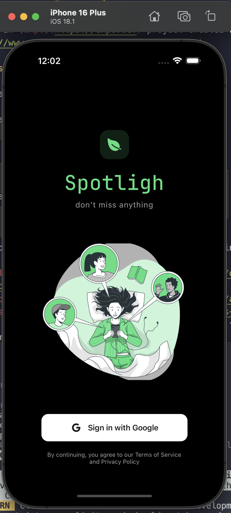  |  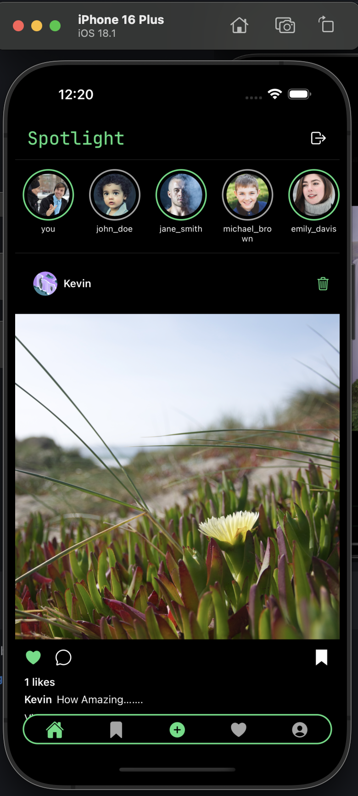  | 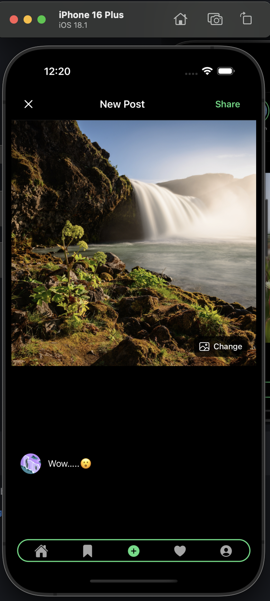 |
|  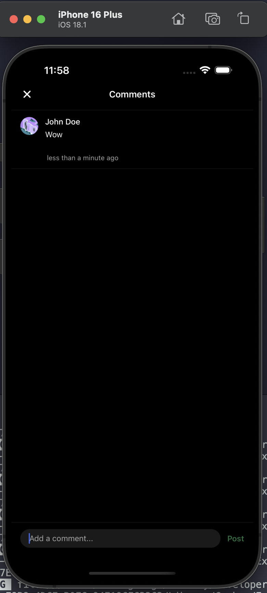  |  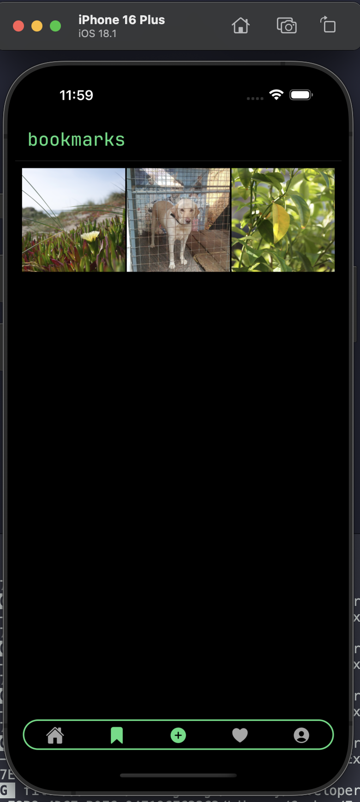  | 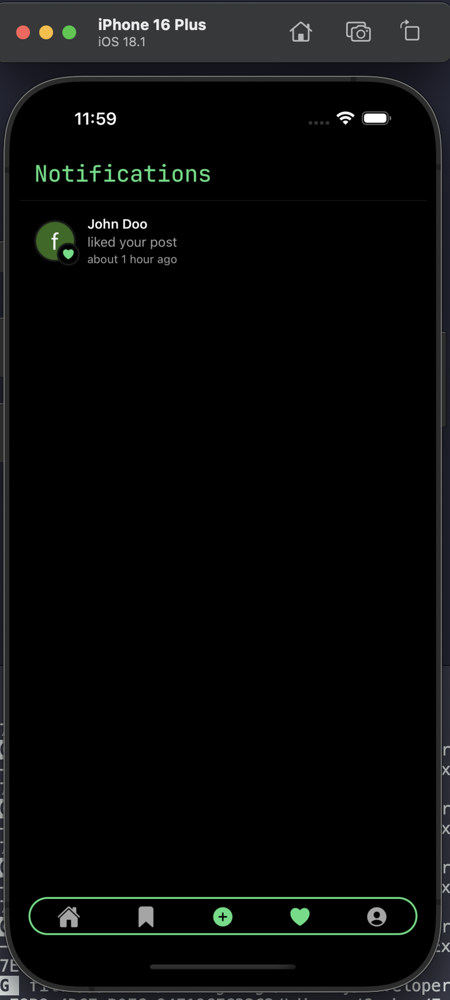 |
|  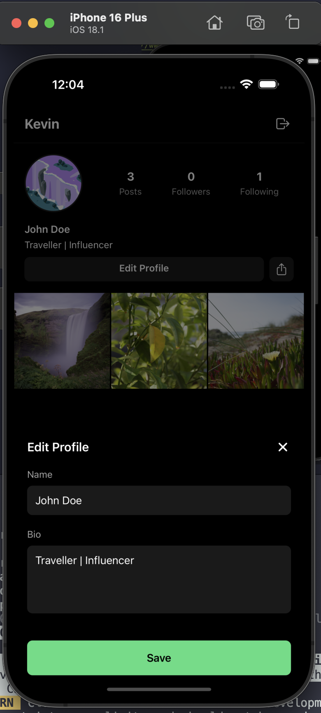  |  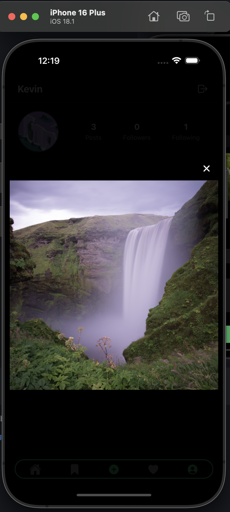  | 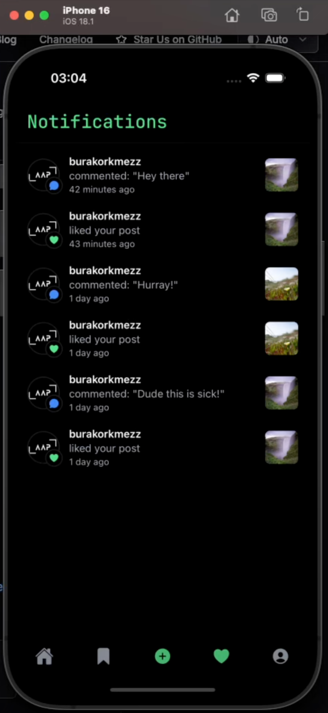 |
| 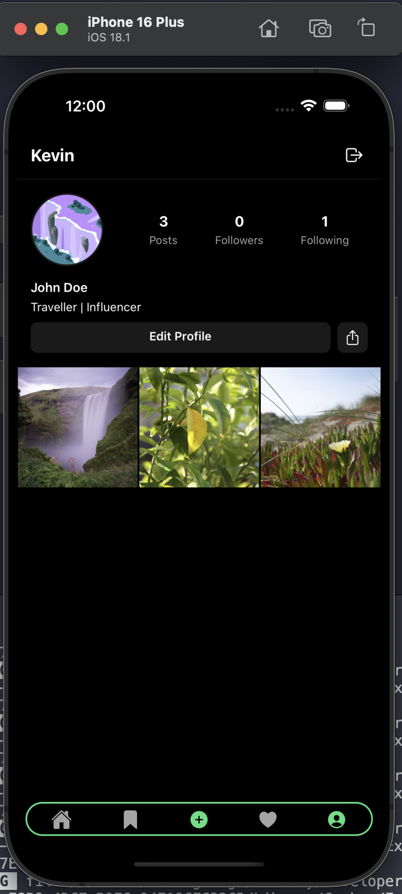 | 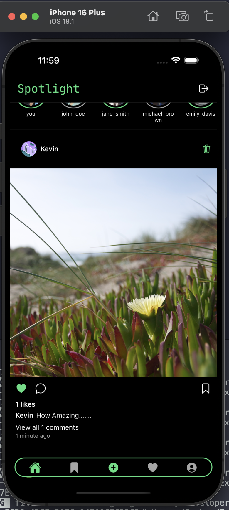 |                                                               |

</div>
